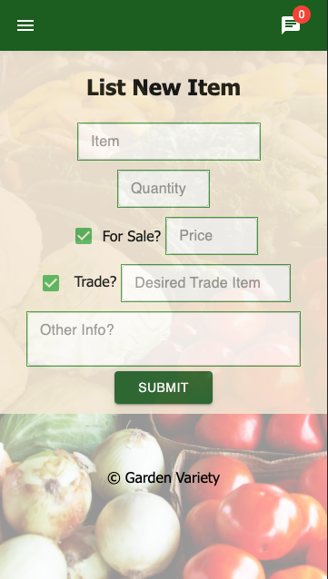

# Garden Variety

This application is designed to allow local gardeners the ability to trade or sell any extra fruits or veggies. There is an integrated chat functionality that allowers gardeners to interact and determine meeting times and locations. It is easy to browse the available listings and determine what is available. Listing items on the market is as simple as a few clicks. 

This application was presented on Facebook live and Zoom on 5/3/2021. 

## Technologies

Javascript
- HTML
- CSS
- Material UI
- React
- Redux
- Saga
- Express
- Node
- Postgres

